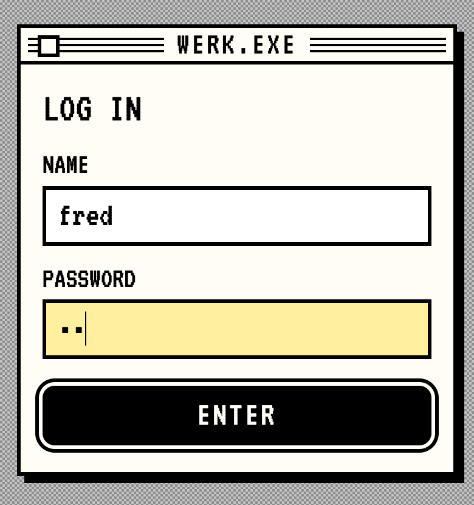
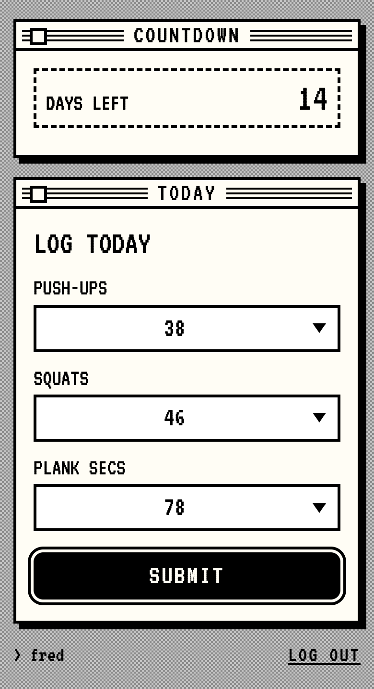
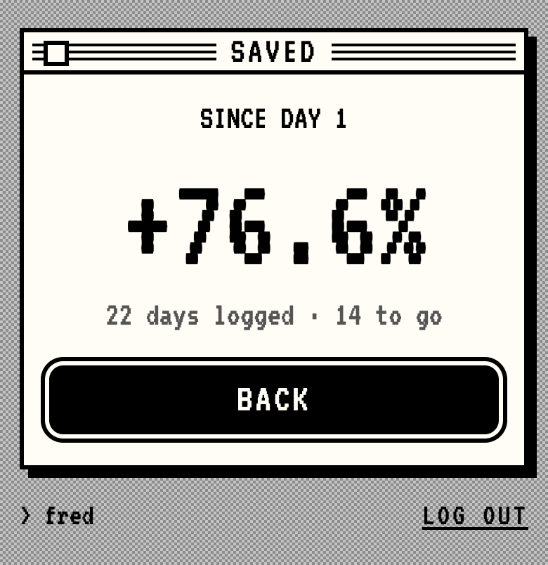
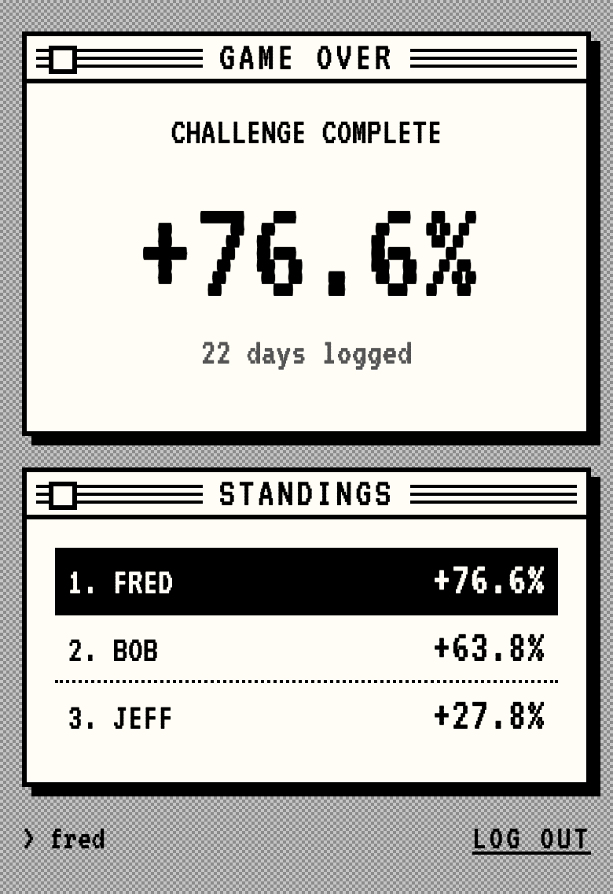
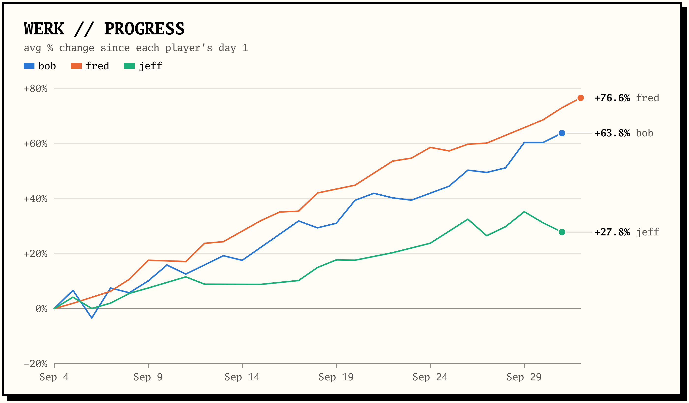
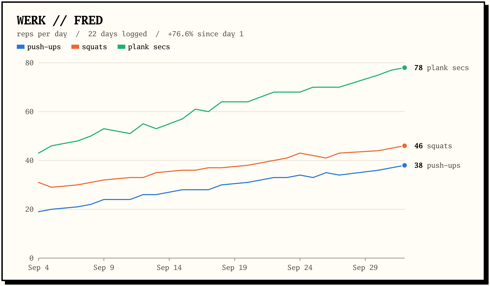

# werk

A tiny workout challenge. Go + SQLite in one container.

Reps are 5–200. Progress = average across the 3 workouts of the % change from
the first logged day to the most recent one. Only today's entry is editable;
missed days are just gaps. The day rolls over at midnight in `$TZ`.

## Deploy

On the server:

```
sudo mkdir -p /srv/docker-data/werk
sudo chown 65532:65532 /srv/docker-data/werk
docker compose up -d werk
```

To ship a new version after pushing here: `docker compose up -d --build werk`.

## Set up the challenge

```
docker exec werk /werk adduser mom <password>
docker exec werk /werk adduser dad <password>
docker exec werk /werk enddate 2026-11-30
docker exec werk /werk users
```

## Other commands

```
docker exec werk /werk passwd  <name> <password>   # reset password + log them out
docker exec werk /werk deluser <name>              # drops the user and ALL their data
docker exec werk /werk enddate none                # clear the end date
docker exec werk /werk standings                   # everyone's % change, best first
```

## Plots

`plot` writes a PNG to stdout. Use `docker exec` **without** `-t` so the bytes
come through clean:

```
docker exec werk /werk plot > progress.png        # everyone's progress
docker exec werk /werk plot fred > fred.png       # one player's reps per workout
```

## Starting a new challenge

When the end date passes, everyone sees a game-over screen with their final
number and the standings. To start over:

```
docker exec werk /werk plot > final.png            # optional: keep a souvenir
docker exec werk /werk reset --yes
docker exec werk /werk enddate 2027-01-31
```

`reset` first copies the database to `/data/werk-<timestamp>.db`. It then
clears all entries, workouts and the end date. Users and passwords stay, and
everyone picks new workouts the next time they log in. To plot an old
challenge, point a one-off container at the backup:

```
docker run --rm -v /srv/docker-data/werk:/data -e WERK_DB=/data/werk-20261130-090000.db werk plot > old.png
```

## Local run

```
docker build -t werk . && docker run -p 8080:8080 -e TZ=America/New_York werk
```

## Screenshots

Demo data: fred, jeff and bob, four weeks in.

| Log in | Log today | Saved | Game over |
|:-:|:-:|:-:|:-:|
|  |  |  |  |

`werk plot`



`werk plot fred`


